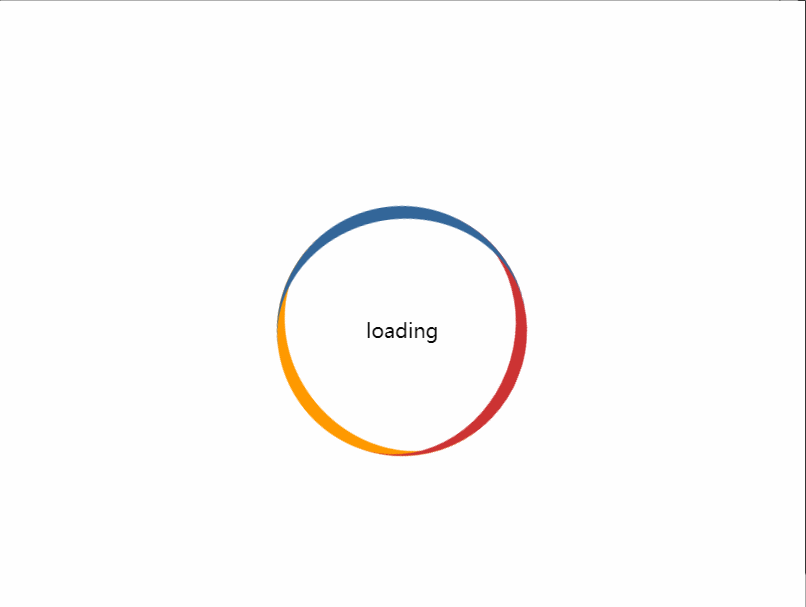
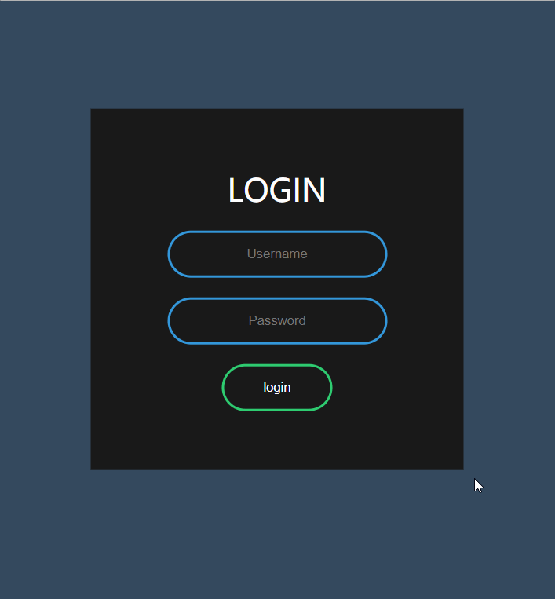
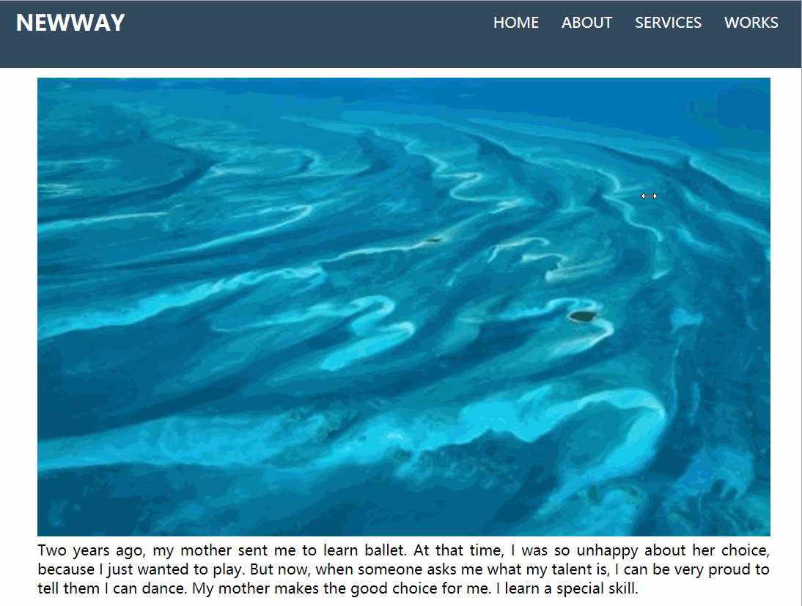
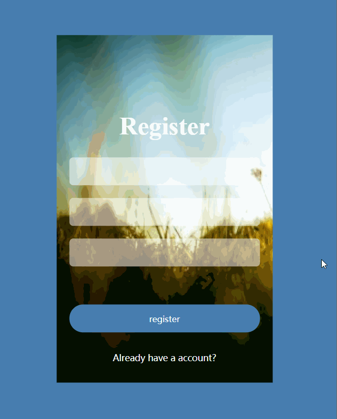
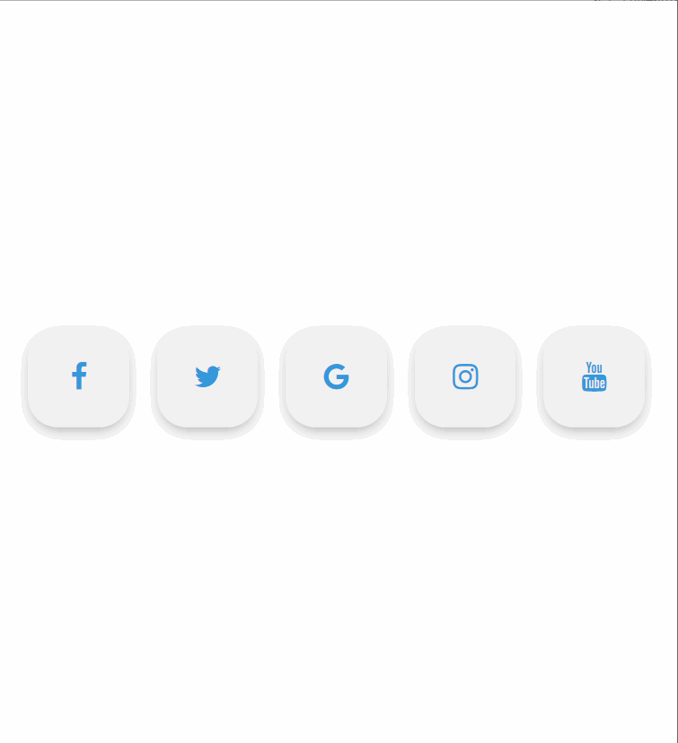
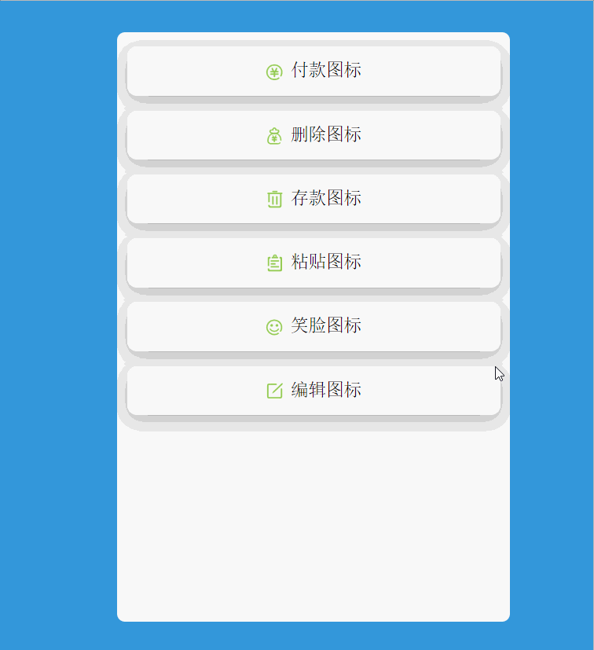
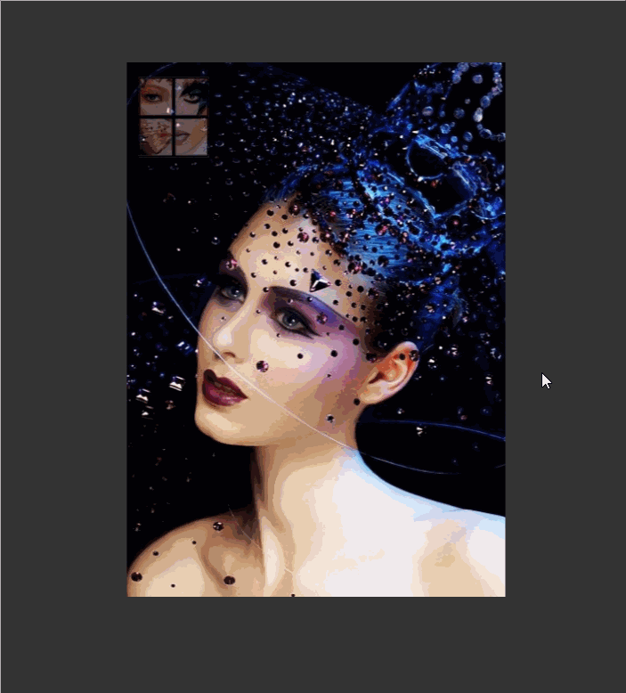
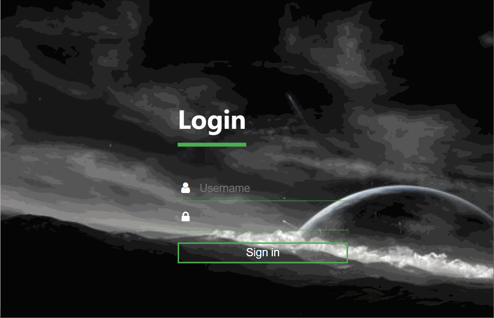

# CodePen

>本项目主要开发和收集一些小的前端特效，作为学习和交流使用。
## 目录 

1. [html+css实现加载动画 ](src/html/加载动画.html) 

1. [html+css实现3D名片 ](src/html/3d名片.html)  

1. [滑动评论 ](src/html/滑动评论.html)  

1. [登录 ](src/html/登录.html)  

1. [自适应导航栏 ](src/html/自适应导航栏.html)  

1. [注册 ](src/html/注册.html)  

1. [交互按钮](src/html/交互按钮.html)  

1. [spriteButtons](src/html/spriteButtons.html)  

1. [翻转card](src/html/翻转card.html)  

1. [登录2 ](src/html/登录2.html)  
